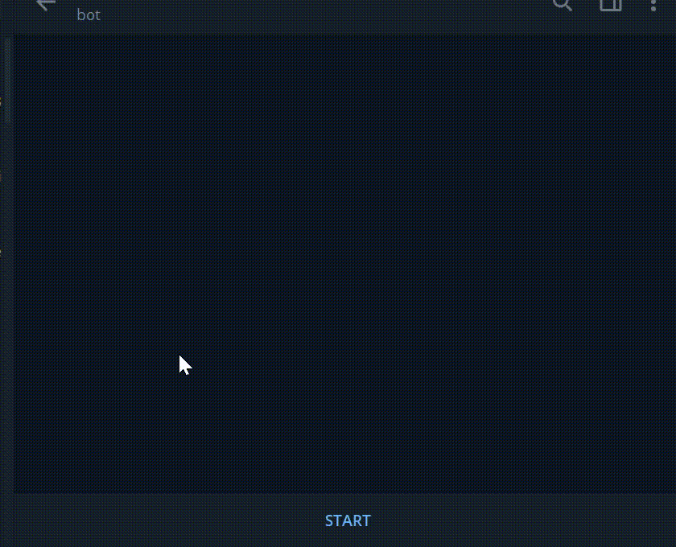

# Kleinanzeigen-alert


A very simple telegram bot that notifies you of new Ebay-Kleinanzeigen listings.
Check it out on Telegram [@AlertAlertAlert_bot](https://t.me/AlertAlertAlert_bot).


## Demo



## Installation
Get your telegram token from @botfarther

Run with Docker:

```bash
    git clone https://github.com/DanielStefanK/kleinanzeigen-alert.git kl && cd kl
    nano docker-compose.yaml //replace mytoken with your token
    docker-compose up
```
Just run it:

```bash
    git clone https://github.com/DanielStefanK/kleinanzeigen-alert.git kl && cd kl
    export TELEGRAM_APITOKEN=mytoken //replace mytoken with your token
    go get
    go run main.go
```

## Usage/Examples

 add a new search query:
```bash
/add search term, city, radius, min_price, max_price, sale_type
```
Note: the last three parameters are optional
lists all search queries and show the corresponding ids:
```bash
/list
```
remove search query with the id ID:
```bash
/remove ID
```

## Author
- [@DanielStefanK](https://github.com/DanielStefanK)

## Contributors
- [@Johannes-ece](https://github.com/Johannes-ece)

  